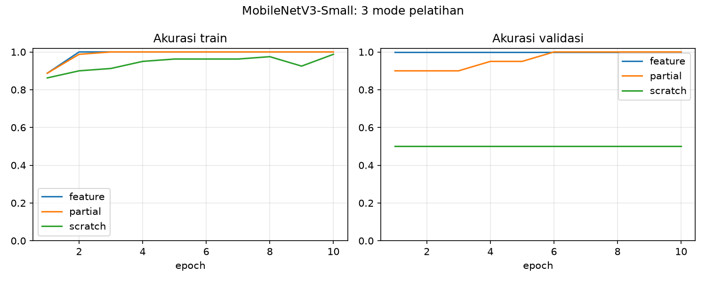

# RET503 Willy : Transfer Learning dengan MobileNetV3-Small

Proyek ini membandingkan tiga cara transfer learning (feature, partial, scratch) pada MobileNetV3-Small untuk membedakan dua kelas objek, botol dan box.

Sumber dataset: dataset dari satu kluster. Pembagian train/val dibuat ulang oleh `scripts/split.py` berdasarkan urutan waktu file.

Klasifikasi 2 kelas (`botol`, `box`) memakai MobileNetV3-Small pretrained ImageNet, membandingkan tiga mode pelatihan.

## Isi repo

| Path | Keterangan |
|---|---|
| `docs/desain_awal.md` | Dokumen desain awal |
| `dataset_raw/` + `metadata.csv` | 50 citra/kelas (botol, box) |
| `data/` | Hasil split 80/20 (`scripts/split.py`) |
| `scripts/` | `split.py`, `train.py`, `latency.py`, `report.py` |
| `results/` | Tabel hasil, grafik akurasi, latensi |

## Cara menjalankan

```bash
pip install -r requirements.txt
./run_all.sh
```

## Metode

- Model: `torchvision` MobileNetV3-Small, head baru (`classifier[3]`, 2 kelas)
- Preprocessing: 224x224, RGB, mean/std ImageNet
- Augmentasi train: RandomResizedCrop, HorizontalFlip, ColorJitter
- 10 epoch, Adam, CosineAnnealingLR, seed 42
- Split: 80/20 menurut urutan nama/waktu file untuk mengurangi data leakage

| Mode | Bobot awal | Yang dilatih | Learning rate |
|---|---|---|---|
| feature | ImageNet | classifier | 1e-3 |
| partial | ImageNet | 4 blok terakhir + classifier | 1e-4 / 1e-3 |
| scratch | acak | semua | 1e-3 |

## Hasil

| Mode | Akurasi val terbaik | Waktu latih (detik) | Epoch pertama val >= 90% |
|---|---|---|---|
| feature | 100.0% | 16.7 | 1 |
| partial | 100.0% | 19.0 | 1 |
| scratch | 50.0% | 32.8 | tidak tercapai |



## Latensi

Perangkat: HP Laptop 14s-fq0xxx, AMD Ryzen 3 3250U with Radeon Graphics, 5 GB RAM, tanpa GPU

| Model | Rata-rata (ms) | p95 (ms) | FPS |
|---|---|---|---|
| mobilenet_v3_small | 17.2 | 21.9 | 58.0 |
| resnet18 | 104.2 | 131.4 | 9.6 |

Anggaran inferensi dari slide 16: 35 ms per frame (15 FPS).

## Analisis singkat

Mode feature dan partial sama-sama mencapai akurasi validasi 100% dan sudah melewati 90% sejak epoch 1, sedangkan mode scratch hanya 50% dan tidak pernah mencapai 90% dalam 10 epoch. Selisihnya 50 poin persentase, sehingga bobot pretrained ImageNet terbukti sangat membantu pada data sedikit (80 citra latih): fitur tepi, tekstur, dan bentuk sudah dipelajari sebelumnya, sedangkan scratch harus mempelajarinya dari nol. Mode feature (16,7 detik) dan partial (19,0 detik) lebih cepat dilatih daripada scratch (32,8 detik). Karena feature sudah 100%, membuka blok tambahan (partial) tidak memberi keuntungan pada dataset ini.

Latensi MobileNetV3-Small rata-rata 17,2 ms (p95 21,9 ms, sekitar 58 FPS) sehingga masuk anggaran inferensi 35 ms pada slide 16, sedangkan ResNet-18 rata-rata 104,2 ms (sekitar 9,6 FPS) dan melebihi anggaran. MobileNetV3-Small dipilih sebagai model robot. Pengukuran dilakukan di laptop, jadi angka di perangkat onboard (misalnya Raspberry Pi) perlu diukur ulang.

Keterbatasan: data validasi hanya 20 citra (satu kesalahan sama dengan 5%), sehingga akurasi 100% belum tentu berlaku di lapangan. Kedua kelas berasal dari sumber foto berbeda (botol 200x150 piksel, box 512x384 piksel), sehingga model mungkin memanfaatkan perbedaan karakter foto, bukan hanya bentuk objek. Perbaikan berikutnya: ambil ulang kedua kelas dengan kamera robot yang sama, tambah variasi jarak, cahaya, dan latar, serta pisahkan data validasi berdasarkan sesi pengambilan.
